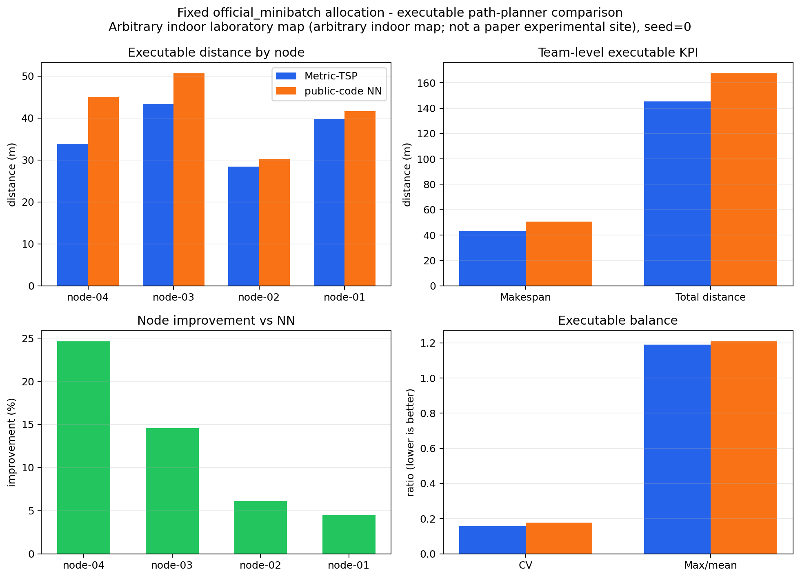

# Executable KPI Result

“동일한 `official_minibatch` 할당, `seed=0`, `auction_bias=0.5` 조건에서, 경로 평가는 셀 중심의 직선거리 대신 valid cell 사이의 4-neighbor grid-adjacent executable 경로와 no-fly zone 차단을 적용하였다. 이 실행 기준에서 Metric-TSP는 모든 노드에서 public-code NN보다 짧은 경로를 생성했으며, 팀 전체 기준으로 makespan은 43.266 m로 50.656 m 대비 14.59% 감소했고, 총 경로 길이는 145.336 m로 167.506 m 대비 13.24% 감소했다.”

## Node-level summary

| Node | Metric-TSP exec (m) | NN exec (m) | Improvement |
|---|---:|---:|---:|
| node-04 | 33.886 | 44.971 | 24.65% |
| node-03 | 43.266 | 50.656 | 14.59% |
| node-02 | 28.430 | 30.277 | 6.10% |
| node-01 | 39.754 | 41.602 | 4.44% |

## Team-level summary

| KPI | Metric-TSP exec | NN exec | Improvement |
|---|---:|---:|---:|
| Makespan (m) | 43.266 | 50.656 | 14.59% |
| Total distance (m) | 145.336 | 167.506 | 13.24% |

